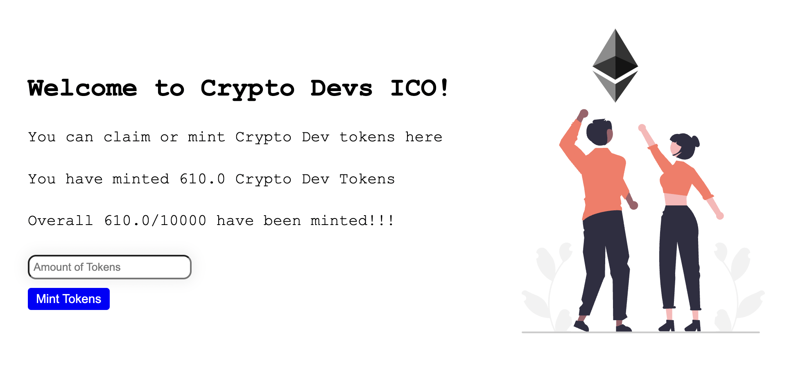
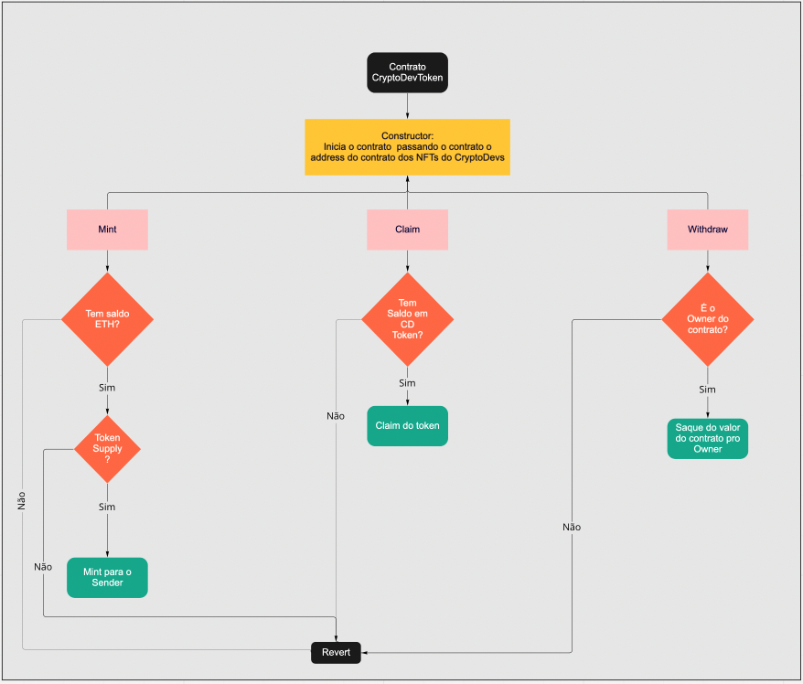

# Initial Coin Offering

Here, lets to launch a token for Crypto Devs. Let's call the token Crypto Dev Token.

- There should be a max of 10,000 CD tokens.
- Every Crypto Dev NFT holder should get 10 tokens for free but they would have to pay the gas fees.
- The price of one CD at the time of ICO should be 0.001 ether
- There should be a website which users can visit for the ICO.

## Prerequisites

- You must have created previosly the NFT collection. You can find how to do here https://github.com/ffelipesimoes/nft-collection

## About Smartcontracts

- We will need to call the CryptoDevs Contract that you deployed for your previous level to check for owners of CryptoDev NFT's. As we only need to call tokenOfOwnerByIndex and balanceOf methods, we can create an interface for CryptoDevs contract with only these two functions.This way we would save gas as we would not need to inherit and deploy the entire CryptoDevs Contract but only a part of it.



## Running the code

#### **Blockend**

To build the smart contract we would be using Hardhat. Hardhat is an Ethereum development environment and framework designed for full stack development in Solidity. In simple words you can write your smart contract, deploy them, run tests, and debug your code.

Once all needed files are here, you just need run:

`npm install`

Now create a .env file in the hardhat-tutorial folder and add the following lines, use the instructions in the comments to get your Alchemy API Key URL and RINKEBY Private Key. Make sure that the account from which you get your rinkeby private key is funded with Rinkeby Ether.

```
// Go to https://www.alchemyapi.io, sign up, create
// a new App in its dashboard and select the network as Rinkeby, and replace "add-the-alchemy-key-url-here" with its key url
ALCHEMY_API_KEY_URL="add-the-alchemy-key-url-here"

// Replace this private key with your RINKEBY account private key
// To export your private key from Metamask, open Metamask and
// go to Account Details > Export Private Key
// Be aware of NEVER putting real Ether into testing accounts
RINKEBY_PRIVATE_KEY="add-the-rinkeby-private-key-here"

```

#### **FrontEnd**

To develop the website we used React and Next Js. React is a javascript framework which is used to make websites and Next Js is built on top of React.

Get in the my-app folder and run:

`npm install`

`npm run dev`

Now go to http://localhost:3000, your app should be running 🤘
